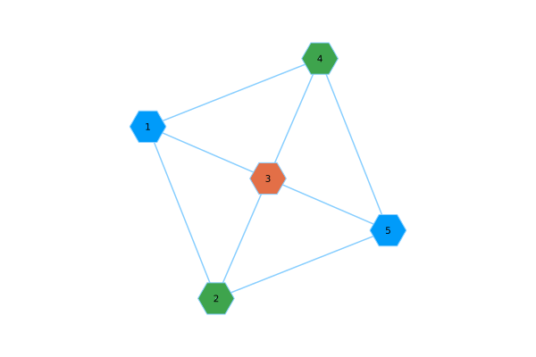
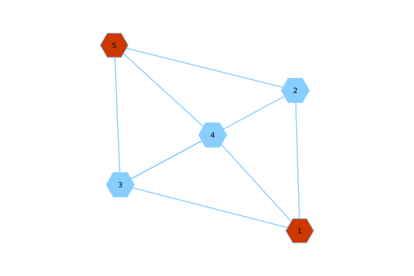

# Walk through: a first iteration

This walk through is not meant to be compelted code, in fact it is not. I am still working on this functionality. I am developing an algorithm based off of the paper linked in the `README.md` of this repository. The manner in which this project is being developed can be described as iterative. This means that the code presented here, once completed, will not yield an MBQC which can execute the protocal. This version will simply lay out the broad strokes of the processes. If a piece of functionality is not completed, then I place holder function will be used.

To emulate this verification protocol. Start by activating your local project

```julia
using Pkg
Pkg.activate(".")
```

If `RobustVerificationSimulator.jl`has not been installed, then

```julia
] add https://github.com/fieldofnodes/RobustVerificationSimulator.jl
```

then

```julia
using RobustVerificationSimulator
```

We simulate a random graph to represent our circuit with the following values.

```julia
p₁ = p₂ = 0.5
N = 1000
v = 5
e = 8
reps=100
```

Here `p₁` and `p₂` are probability values used for stochastic sampling while the simulator software is being developed. Once completed this functionality will be replaced with the appropriate function calls. The number of rounds is represented by `N`, `v` and `e` represent the number of vertices and edges in the graph. In the circuit each `v` is a qubit and each `e` is the `CZ` gate establishing entanglement between the qubits. Finally `reps` is the number of repetitions used to approximate a graph colouring.

```julia
graph_for_client = generate_simple_graph(v,e)
```

We generate a graph with `v` vertices and `e` edges. For the time being this graph is contructed randomly. We call this 'graph_for_client` to indicate this graph is still on the client side of the protocol. Once we are ready to send this graph to the server, we then bound the graph to a different label, namely an indication that the graph is for the server.

The output

```julia
{5, 8} undirected simple Int64 graph
```

We take `graph_for_client` and convert it to a `MetaGraph`, this is a graph which allow properties to be set to the graph, qubits or edges. As we have not implemented the quantum simulator yet, we construct this meta graph. These properties attached can be the angles and the qubit type. This graph is prepared for the `Computation` round. The graph associated with the `Test` rounds will be generated in a `for` loop. 


```julia
meta_graph_for_client = @chain graph_for_client begin
    MetaGraph(_)
    generate_property_graph!(_,ComputationRound())
end
```

The output

```julia
{5, 8} undirected Int64 metagraph with Float64 weights defined by :weight (default weight 1.0)
```

```julia
g_cols = generate_random_greedy_color(graph_for_client,reps)    
```

Here `g_cols` is the coloring of `graph_for_client` which is optimised over the `reps`

The output

```julia
Graphs.Coloring{Int64}(3, [1, 3, 2, 3, 1])
```

The first element, `3`, represents the number of colors, and `[1, 3, 2, 3, 1]` represents the coloring. We then need to separate each colour and bind it to another graph for our `Test` rounds.

We can run

```julia
contruct_coloring_plot_for_all_colors(graph_for_client,g_cols.colors)
```

to get a plot for the colouring.



```julia
g_diff_cols = separate_each_color(g_cols)
```

We create a `g_diff_cols` a vector of vectors, each one is a different colouring of the graph.

```julia
3-element Vector{Vector{Int64}}:
 [2, 1, 1, 1, 2]
 [1, 1, 2, 1, 1]
 [1, 2, 1, 2, 1]
```

Each vector is a different colouring. The top vector `[2, 1, 1, 1, 2]` is a single colour set. Elements that are `1` are the `DummyQubit` qubits and `2` are the `Test` qubits. As an example of a individual colouring



Next we move into the construction of the rounds. Here we select the `N` rounds from above. We will iterate from `1` to `N` and for the time, at each iteration we will select with probability `p₁` whether the round is a `Test` or a `Computation`. We note that the `Redo` function has not been implemented yet. We also need to construct the actual quantum simulator for qubit and gate construction. 

For now consider this an overview what is being completed in client-side preparation.

```julia
graphs_for_server = []
for i in Base.OneTo(N)
    round_type = choose_test_computation(p₁)
    if round_type isa Test
        # Create property graph
        client_process_graph = MetaGraph(graph_for_client)
        # Add round type
        set_prop!(client_process_graph, :round_type, TestRound())
        # Sample colouring
        trap_dummy_vector = get_random_coloring(g_diff_cols)
        # Generate trap/test graph
        generate_property_graph!(client_process_graph,round_type,trap_dummy_vector)
        # Make copy of 
        graph_for_server = copy(client_process_graph)
        # Remove secrete properties of client graph
        #rem_prop!(mgraphs_for_server, 1, :name)
        # Verify bᵥ = rᵥ ⊕ dᵥ 
        #   for v ∈ Trap and N(v) ∈ DummyQubit, 
        #   dᵥ = ⨁ᵢ ∈ N(v) dᵢ
        # Outcome for round = 
        #   1 for bᵥ = rᵥ ⊕ dᵥ is true and 
        #   0 for bᵥ = rᵥ ⊕ dᵥ  is false
        # Get outcome for round
        set_prop!(client_process_graph, 
            :round_outcome, compare_trap_test())
        # Return bᵥ
    elseif round_type isa Computation
        client_process_graph = copy(meta_graph_for_client)
        set_prop!(client_process_graph, :round_type, ComputationRound())
        set_prop!(client_process_graph, 
            :round_outcome, rand_int())
    else
        error_call_not_test_computation()
    end        

    push!(graphs_for_server,graph_for_server)
end
```

1. We create an empty vector `graphs_for_server = []`, this is to be considered the graphs that are to be sent to the server.
2. We have three paths,
    + The round is a `Test`
    + The round is a `Computation`
    + A safety error is thrown if there is some bug.
3. For `Test`
    + We create a property graph
    + We prototyping and round evaluation we add the round type to the graph.
    + We sample uniformly from our set of different graph colour configurations.
    + We generated the `Trap` and `DummyQubit` graph and add attributes per vertex.
    + We make a copy of this graph.
        + One copy is for the client
        + One copy, which is stripped of secret properties, is sent to the server.
    + The server returns bᵥ and we verify 
        + bᵥ = rᵥ ⊕ dᵥ
        + for v ∈ Trap and N(v) ∈ DummyQubit,
        dᵥ = ⨁ᵢ ∈ N(v) dᵢ
        + These were generated when we generated the `Trap` and `DummyQubit` graph. 
        + Outcome for round:
        + 1 for bᵥ = rᵥ ⊕ dᵥ is true and 
        + 0 for bᵥ = rᵥ ⊕ dᵥ  is false
        + Store round outcome
4. For `Computation`
    + We generate 2 copies of the client graph
    + We add the round type to one of the  property graphs and save
    + We send a public graph to the server to obtain results.
    + At the moment we simple choose at random `0` or `1` the result.
         + This is a temporary place holder.


This is the current workflow which I have developed in part to help me understand the workflow of the verificatation protocol. I am still learning it.

## Caveats
This model illustrates incompletely and very roughly the process for preparing a graph which is meant to represet the MBQC circuit and to obtain some results. In this current state the results and even the correctness of the model is not importatn. The important component is building the first layer. This first layer is set to roughly convert the verification protocol into working code. 

The next few steps are to flush out the remainder of the protocol so that we can prepare a theoretical symbolic state of a qubit, "send" it to a "server" and measure it along the appropratie basis, then draw with the correct probabtility the outcome measurement. This will again not be the completed project, but an iteration in which a further detail of the protocol is further converted into working code.

Either in tandem or once this is completed, an MBQC simulator needs to be developed to execute this protocol in a simulation. These progress points will only be dealing with the internal mechanisms of the protocol and will say nothing of a modular algorithm that needs to be developed.
    